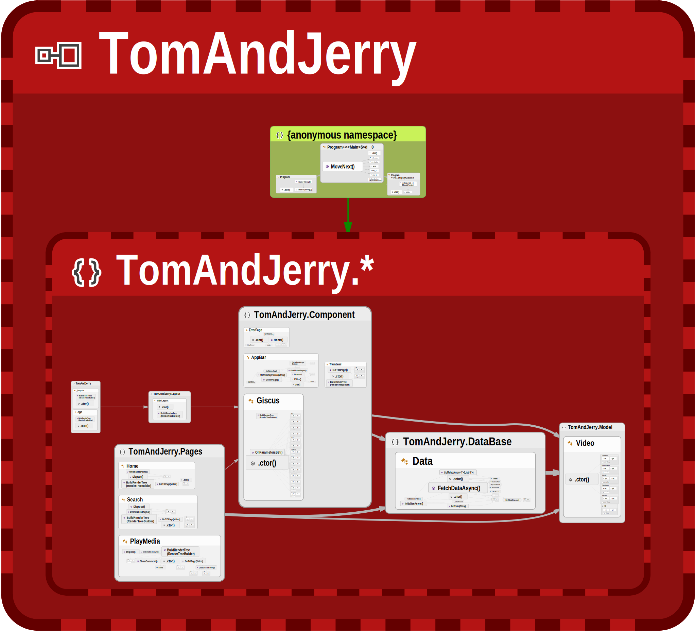

# TomAndJerry



## Some How Shed Command is not changing based address in github action

> Tip To Fix this Issue Is 
    
1) Before Pushing To Github Just add Repo Name in Index Htmls Like 
    ```
   <base href="/TomAndJerry/" />
   ```
2) In YAML File Somehow Shed Command Is not working so use below some Sweet Code

```yaml
name: watchTom

on:
  push:
    branches: [ "master" ]

jobs:
  build:
    runs-on: ubuntu-latest

    steps:
      - name: Checkout repository
        uses: actions/checkout@v2

      - name: Setup .NET
        uses: actions/setup-dotnet@v2
        with:
          dotnet-version: 8.0.x

      - name: Publish Blazor WebAssembly project
        run: dotnet publish TomAndJerry.csproj -c Release -o release --nologo

      - name: Add 404.html (for GitHub Pages SPA fallback)
        run: cp release/wwwroot/index.html release/wwwroot/404.html

      - name: Add .nojekyll file
        run: touch release/wwwroot/.nojekyll

      - name: Deploy to GitHub Pages
        uses: JamesIves/github-pages-deploy-action@4.1.5
        with:
          token: ${{ secrets.GITHUB_TOKEN }}
          branch: gh-pages
          folder: release/wwwroot
```